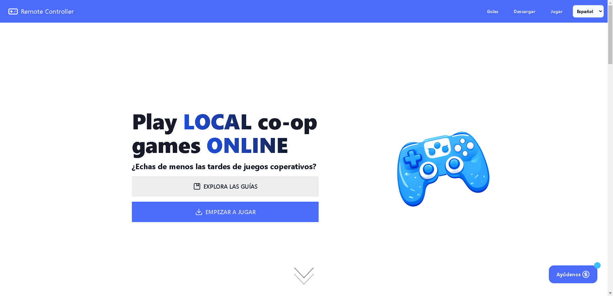

#  Remote Controller
### An open source & decentralized alternative to Steam remote play (No need to self host)

⌛ Looking for contributions 👈

> [!Note]
> Website: 
> https://remote-controller.vercel.app/ 

## Use cases ✨

- Play with friends online
- Enjoy videogames from other devices using your gamepad
### The limit is in your imagination ... 

## Download 📦

- https://remote-controller.vercel.app/download/

## Guides 📘

- [Instalation guide](https://remote-controller.vercel.app/info/guides/installation/)
- [How to use](https://remote-controller.vercel.app/info/guides/how-to-use/)

## Resources 📚

- [Docs](./docs/) 📘
- [FAQ](https://remote-controller.vercel.app/info/resources/faq/) 💬
- [Security](https://remote-controller.vercel.app/info/resources/security/) 🔐

- https://github.com/user-attachments/assets/f4a412fa-f403-4429-85fb-9c1e74bff458

(Note that videos may show beta versions of the APP and could have bugs)

## Features 🧩

- [x] Portable
- [x] Simple & Modern UI
- [x] P2P "Decentralized" (WebRTC)
- [x] Remote Streaming
- [x] Browser Client
- [x] Support for keyboard
- [x] ViGEmBus Setup (Windows)
- [x] Localization (translation to multiple languages)
- [x] Support for STUN & TURN

### OS Support 💻

| Windows 	| Linux 	| MacOS 	| Browser (Only Client) 	|
|---------	|-------	|-------	|---------	|
| ✔       	| (Only keyboard)⌛ Looking for contributions for Gamepad     	| (In theory keyboard works)⌛ Looking for contributions for Gamepad     	| ✔ (Known Issues with Safari)       	|

### Native Gamepad Support 🎮

| PC Controller (XInput/DirectInput) 	| Xbox Controller (XInput) 	| PlayStation Controler
|---------	|-------	|-------	|
| ✔       	| ✔     	| ❌ (You can achieve emulating a Xbox Controller)     	|

### Translations 🔠

| English 	| Spanish 	| Galician | Russian | French |Other languages |
|---------	|-------	|-------	| ------- | ------- | ------- |
| 100% ✔     	| 100% ✔      	| 100% ✔      	| 100% ✔ | 100% ✔ (@Zorkyx22) |⌛ Looking for contributions

## Self Hosting ☁

There is no way to self-host the infrastructure of RemoteController because it has no backend. But instead you can self-host if you want the TURN & STUN servers and then add them to the config.

- If you want to self-host a TURN/STUN server you can [try Coturn](https://github.com/coturn/coturn). (This is only an example, you can choose other STUN/TURN implementations)

- Also you can host the Web version (but it is only frontend) to make like a network of Remote Controller web clients

## Run Dev

### Prerequisites

You must have Task CLI, Wails CLI, NodeJS, pnpm and Golang installed.

### How to

Go to the root project folder and run

  - Full App :

    `$ task dev-all`

  - Frontend:

    `$ task dev-front`

## Build

### Prerequisites

You must have Task CLI, Wails CLI, NodeJS, pnpm and Golang installed.

### How to

Go to the root project folder and run

- For general builds:

    `$ task build`

- For Windows builds:

    `$ task build-win`

- For Linux builds:

    `$ task build-linux`

finally go to the build/bin folder and your executables will be there.

> [!Note]
> Please note the supported platforms in the table

## Contributting 🤝

If you are interested to contribute to this project you can follow this [guide](./CONTRIBUTING.md)

## Thanks to the ViGEm project ♥
[ViGEmBus](https://github.com/nefarius/ViGEmBus) is making this project a reallity. We embed ViGEmBus Installation Wizard and ViGEmBus Client DLLS within the executable for Windows

## Did you like the project 👍 ?
You can give a star and review us on Product Hunt

## Star History
Here you can see how fast the community is growing
 

