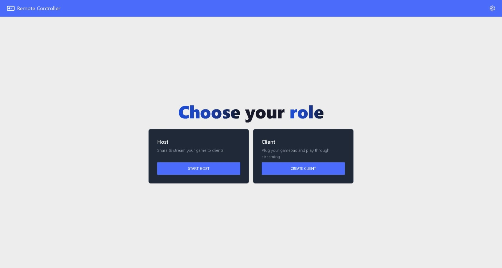

#  Remote Controller 
Remote gamepads without difficulties

> [!Note]
> Website: 
> https://remote-controller.vercel.app/ 

### Use cases ✨

- Play with friends online
- Controll your games from other machines with a gamepad
- Create a professional gaming cloud platform (it would require modifications to interact with through the shell)

### Installation 📦

- https://remote-controller.vercel.app/download/

### Guides 📘

- [Instalation guide](https://remote-controller.vercel.app/info/guides/installation/)
- [How to use](https://remote-controller.vercel.app/info/guides/how-to-use/)

### Features 🧩

- [x] Portable
- [x] Simple & Modern UI
- [x] P2P "Decentralized" (WebRTC)
- [x] Support for PC/XBOX Gamepads (XInput & DirectInput)
- [ ] Support for PlayStation 3/4/5 Gamepads
- [x] Windows Support
- [ ] Linux Support 
- [x] Remote Streaming
- [x] Browser Client

### OS Support 💻

| Windows 	| Linux 	| MacOS 	| Browser (Only Client) 	|
|---------	|-------	|-------	|---------	|
| ✔       	| ❌     	| ❌     	| ✔       	|

### How it works 👷‍♂️

This desktop APP is based on the WebRTC 🎞 standard and it uses the power of Go to communicate 🗣 with the Gamepad emulation libraries.
In Windows uses the ViGEm Bus Driver with the ViGEm Client DLL

For the low level actions uses Go.
On the other hand the UI works with Web technologies (WASM, Sveltekit, Tailwind, DaisyUI & Typescript)

### Contributting 🤝

If you are intested to contribute to this project you can follow this [guide](./CONTRIBUTING.md)

### Thanks to the ViGEm project ♥
ViGEm is making this project a reallity. We embed ViGEm Installation Wizard and ViGEm Client DLLS within the executable for Windows
